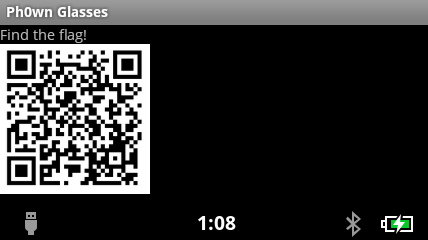
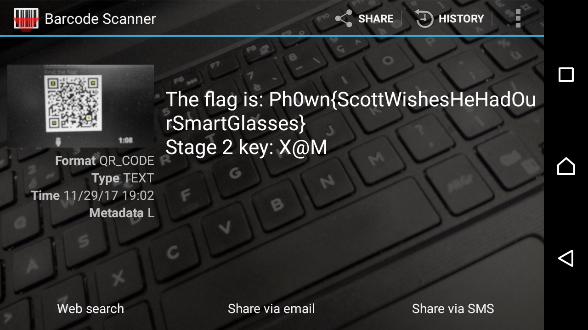

## helpxman - Stage 1

When wearing the smart glasses, we can see there is an application called `Ph0wn Glasses`. Go to that application (by using controller on the glasses, we can see one QR code appears on the screen.

The QR code is much likely have information about the flag. Let's try to read it!

1. Connect the smart glasses with the (ADB already installed) computer.
2. From the command prompt of the computer (`Ctrl+R` --> Type `cmd` --> Press `Enter`). Type:

```
> adb devices
List of devices attached
* daemon not running. starting it now at tcp:5037 *
* daemon started successfully *
<ID of the device>      device
```

=> Make sure the ID of the device appear as above. Otherwise, we have to:
* Turn on `Developer options` in the Settings of the glasses. (The glasses is running Android, so it's the same as any other Android devices).
* Restart `ADB service` on host computer: `> adb kill-server`
* Try to connect with the device (glasses) again: `> adb devices`

3. On the smart glasses, browse to the application, so that the QR code image appears on the screen. The idea is we try to take a screenshot of the glasses, pull it to our host computer and read it by QR code reader.

4. Take a screen shot by `adb` command:
```dos
> adb shell screencap -p /sdcard/screencap.png
```
The screenshot will be saved in the glasses' SDcard.

5. Pull the file to host computer (current working folder):
```
> adb pull /sdcard/screencap.png .
```

6. View the image:
```
> screencap.png
```
We will see it on our computer's screen:



7. Now, let's read the QR code. No need to make things complecated, let's choose a very simple way: show the image on computer's creen, read it with the [Barcode scanner](https://play.google.com/store/apps/details?id=com.google.zxing.client.android&hl=en) app on our normal phone.

It's quickly be recognized as follows:



So, the flag is: `Ph0wn{ScottWishesHeHadOurSmartGlasses}`

And, we note the key `X@M` for the next stage.
